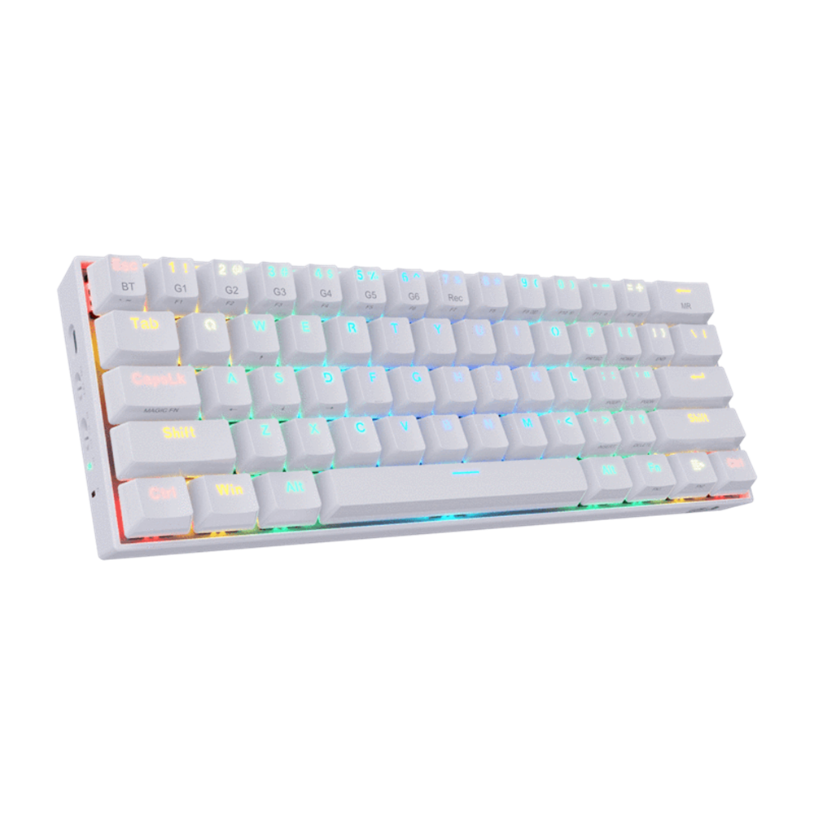
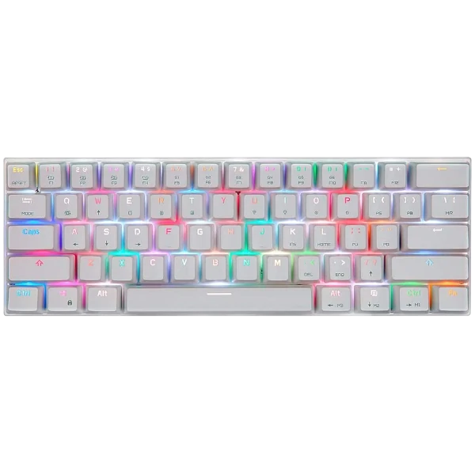

# Autohotkey - Scripts

Estos son mis scripts para mi teclado motospeed ck62, están creados en base a mis necesidades, hago este repo para cuando necesito importar estas configuraciones a otro equipo XD.

# Teclado

    
    

Compra el teclado en el siguiente [link](https://www.mercadolibre.com.mx/teclado-gamer-bluetooth-motospeed-ck62-qwerty-outemu-red-ingles-us-color-blanco-con-luz-rgb/p/MLM16046774)

# GIF (Super importante)

    

