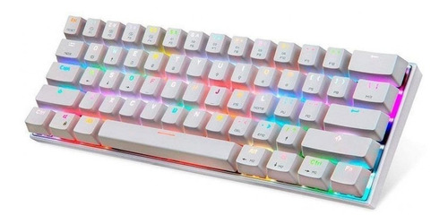

# ck62-config-ahk

Estos son mis atajos de configuración para mi teclado motospeed ck62

# Teclado

Compra el teclado en el siguiente [link](https://www.mercadolibre.com.mx/teclado-gamer-bluetooth-motospeed-ck62-qwerty-outemu-red-ingles-us-color-blanco-con-luz-rgb/p/MLM16046774)

# GIF (Super importante)

